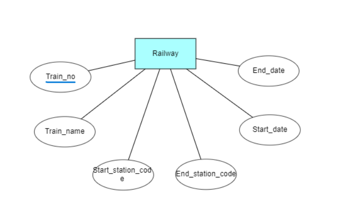

# Ex02 Django ORM Web Application
## Date: 25/03/2024

## AIM
To develop a Django application to store and retrieve data from a Book database using Object Relational Mapping(ORM).

## Entity Relationship Diagram



## DESIGN STEPS

### STEP 1:
Clone the problem from GitHub

### STEP 2:
Create a new app in Django project

### STEP 3:
Enter the code for admin.py and models.py

### STEP 4:
Execute Django admin and create details for 10 books

## PROGRAM

```
#admin.py
from django.contrib import admin
from .models import Railway, RailwayAdmin

admin.site.register(Railway, RailwayAdmin)

#models.py
from django.db import models
from django.contrib import admin

class Railway(models.Model):    
    Train_no = models.IntegerField(primary_key=True)
    Train_name = models.CharField(max_length=50)
    Start_station_code = models.CharField(max_length=20)
    End_station_code = models.CharField(max_length=20)
    Start_date = models.DateTimeField()
    End_date = models.DateTimeField() 
 
class RailwayAdmin(admin.ModelAdmin):
    list_display = ('Train_no','Train_name','Start_station_code','End_station_code','Start_date','End_date')

```
## OUTPUT


## RESULT
Thus the program for creating a database using ORM hass been executed successfully
